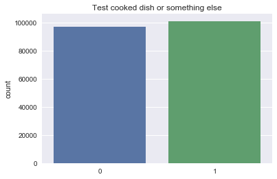
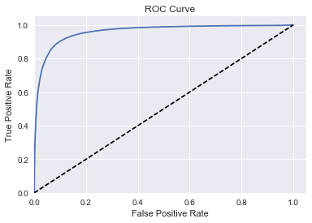
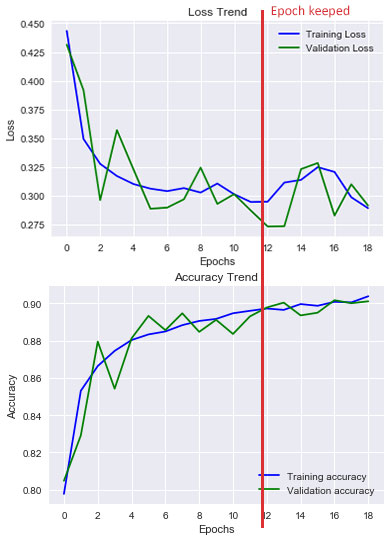
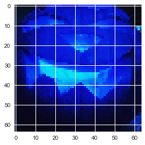
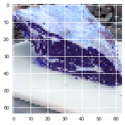
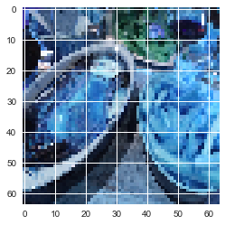

# cookedDishRecognizer
Binary convnet for food image recognizion (Keras tensorflow)

This project answer to the need of recognize cooked dish from supplied pictures. The model is pre-trained and can be used for prediction by runing demo.py (or demo_noDisplay.py from outside a Jupyter notebook). If you're interested of how this have been done and if you speak french, please check the abstact.pdf file.

Important note: I am far to be a neural network expert so I may have done some misinterpretation, errors and my model is not perfect. I think this model can be improved by working on the data-set. Nethertheless I only had one full week to learn from scratch everything on deep learning and neural network and I think my result are prety good. I may keep working on this model and improved it so if you have advise or questions please tell!

## The model
This model is based on [CatdogNet - Keras Convnet Starter](https://www.kaggle.com/jeffd23/dogs-vs-cats-redux-kernels-edition/catdognet-keras-convnet-starter) by [Jeff Delaney](https://www.kaggle.com/jeffd23) witch is already based on [Building powerful image classification models using very little data](https://blog.keras.io/building-powerful-image-classification-models-using-very-little-data.html) from Keras blog.

The main differences are:
- The data have been adapted for the need as well as some adjustment. 
- This script also do cross validation
- Always keep the best weight per epoch depending on the validation loss
- generate more trends (like ROC curve).
- Save the all model (json, weight and model) at each run
- Some refactoring

### Data-set

This is a binary model so I just have two classes:

- cookedDish
- notCookedDish (often called "something else")

If you wish to see how I build my data-set for each classes, please read the two .text file in cookedDishRecognizer/data-set/



### Model Statistics

#### Roc Curve:



#### Accuracy and Losses per epoch:



#### Prediction exemple:

I am 99.92% sure this is something else:



I am 68.02% sure this is something else:



I am 87.32% sure this is a cooked dish:



I am 96.58% sure this is a cooked dish:


## Tested and built on
- Windows 10
- Ubuntu 16.04

## Installing

### With gpu or cpu and Anaconda (Recommended installation):
#### Install Anaconda:
```
cd /tmp
curl -O https://repo.continuum.io/archive/Anaconda3-4.2.0-Linux-x86_64.sh
bash Anaconda3-4.2.0-Linux-x86_64.sh
source ~/.bashrc
```
You can check installation by running "conda list". Try to restart the terminal if it doesn't work.

#### Set up environment:
```
conda create --name tensorflow python=3.5
source activate tensorflow #ubuntu
activate tensorflow #windows
```

#### Install dependencies (please make sur you're in the Anaconda environment):

If you want to have both, please create a new environment
With gpu:
```
pip install tensorflow-gpu
```
With cpu:
```
pip install tensorflow
```
Then:
```
conda install scipy
conda install -c anaconda keras=1.1.1 
conda install -c menpo opencv3=3.2.0
```

#### To add Jupyter notebook support:
```
conda install jupyter
pip install matplotlib==2.0.0b4
conda install -c anaconda pandas=0.19.2
conda install -c anaconda scikit-learn=0.18.1 
conda install -c conda-forge seaborn=0.7.1 
```

### Without Anaconda (Unrecommended installation):

Please install the dependencies:
- Tensorflow: [Follow Tensorflow installation guide (choose gpu if you want)](https://www.tensorflow.org/install/)
- Keras: [Follow Keras installation guide](https://keras.io/#installation)
- Python 3.5
- OpenCv3
Add graphical support:
- Jupyter
- Matplotlib
To re-train model:
- pandas
- sklearn
- seaborn

### Clone the repository
```
git clone https://github.com/plabadille/cookedDishRecognizer
cd cookedDishRecognizer
```

### Predict
Just add your pictures in cookedDishRecognizer/data-set/predictDemo/

This model only support .jpg and .png

Then run the demo script:
```
#without graphical support
source activate tensorflow
cd path/cookedDishRecognizer/
python demo_noDisplay.py 
```
```
#with graphical support
source activate tensorflow
jupyter notebook
#then run demo.py in the notebook
```

### Train the model from scratch

Warning, I can't provide the data-set (to heavy and this is a study set). So you'll need to build your own. If you just want ton learn there's plenty of data-set available for this (like dogs vs cats!).
- Add pictures of your data-set in cookedDishRecognizer/data-set/train
- These pictures have to be directly in the folder and have to been name like this: <CLASSNAME>_<NAME>.jpg/png.

Note: You can use one of the script from cookedDishRecognizer/script to move file outside a folder and rename them automatically (the script have to be copy in cookedDishRecognizer/data-set/train). Don't forget to delete the script after.

- Add your test pictures (not validation, just for test the prediction system) in cookedDishRecognizer/data-set/test/
- Run the model (the script will work without edition but the classname will not be yours):
```
#without graphical support
source activate tensorflow
cd path/cookedDishRecognizer/
python cookedDishModel_noDisplay.py
```
```
#with graphical support
source activate tensorflow
jupyter notebook
#then run cookedDishModel.py in the notebook
```

## Built with

* [`Tensorflow`](https://vuejs.org/)
* [`Keras`](https://router.vuejs.org/en/)
* [`Anaconda`](http://materializecss.com/)
* [`Python 3.5`](http://materializecss.com/)
* [`Jupyter`](http://materializecss.com/)
* [`Scipy`](http://materializecss.com/)
* [`Scikit-learn`](http://materializecss.com/)
* [`Seaborn`](http://materializecss.com/)

### data-set

* [`ETHZ-Food-101 data-set`](https://www.vision.ee.ethz.ch/datasets_extra/food-101/>}{ETHZ-Food-101 data-set)
* [`lfw face data-set`](http://vis-www.cs.umass.edu/lfw/>}{lfw face data-set)
* [`Indoor Scene Recognition data-set`](http://web.mit.edu/torralba/www/indoor.html)
* [`EurasianCitiesBase data-set`](https://graphics.cs.msu.ru/en/research/projects/msr/geometry)
* [`Visual Cognition Laboratory data-set`](http://cvcl.mit.edu/database.html)
* [`KTH-ANIMALS data-set`](https://www.csc.kth.se/~heydarma/Datasets.html)
* [`dogsVsCats data-set`](https://www.kaggle.com/c/dogs-vs-cats-redux-kernels-edition)
* [`Caltech256 data-set`](https://www.vision.caltech.edu/Image_Datasets/Caltech256/)
* [`voc2007 data-set`](http://host.robots.ox.ac.uk/pascal/VOC/voc2007/index.html)
* [`mirflickr data-set`](http://press.liacs.nl/mirflickr/mirdownload.html)

## License

Please feel free to use this model if you need or based one on it! Just cite me and this repo!

This project is licensed under the GNU License - see the [LICENCE](LICENSE) file for details
